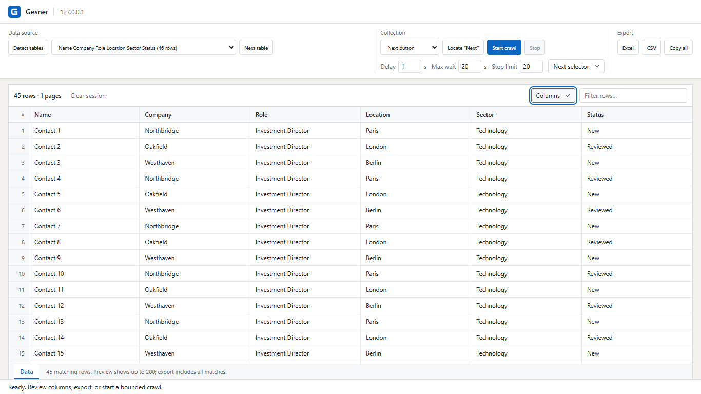
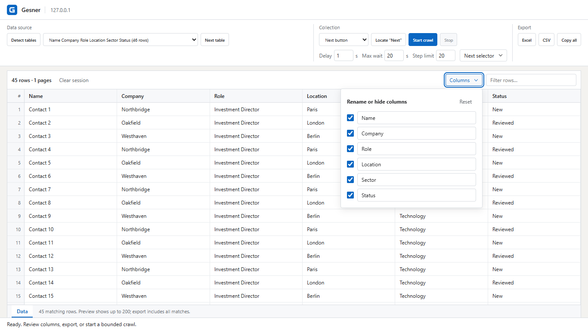

<picture>
  <source media="(prefers-color-scheme: dark)" srcset="docs/brand/logo-dark.svg">
  
</picture>

### Web pages to spreadsheets.

Extract tables and lists from any supported page. Export to Excel or CSV.

**Free. Runs in your browser. No telemetry.**

[Download for Chrome](https://github.com/Nassau-1/gesner/releases/latest) · [Getting started](#getting-started) · [Contribute](CONTRIBUTING.md)

## Collect

Find tables and repeated lists automatically. Follow pagination or infinite scroll to collect more rows.

## Organize

Rename columns, hide what you don't need, and filter your results before exporting.

## Export

Save an Excel file, download a CSV, or copy the rows to your clipboard.

Everything runs locally. No account, API key, or upload.

## Getting started

1. [Download the extension](https://github.com/Nassau-1/gesner/releases/latest) and unzip it.
2. Open `chrome://extensions` and turn on **Developer mode**.
3. Choose **Load unpacked** and select the extracted folder.
4. Open a website, click the extension, then **Detect tables**.

[Usage guide](docs/usage.md) · [Supported pages and limits](docs/usage.md#limits)

## Contributing

Bug reports, feature ideas, and pull requests are welcome.

~~~sh
npm ci --ignore-scripts
npm run check
~~~

Load `dist/` into Chrome to try your changes. See the [contributing guide](CONTRIBUTING.md) for browser tests and development setup.

---

By **[Enzo Terrier](https://github.com/Nassau-1)**.

[License](LICENSE) · [Privacy](PRIVACY.md) · [Security](SECURITY.md) · [Changelog](CHANGELOG.md)
